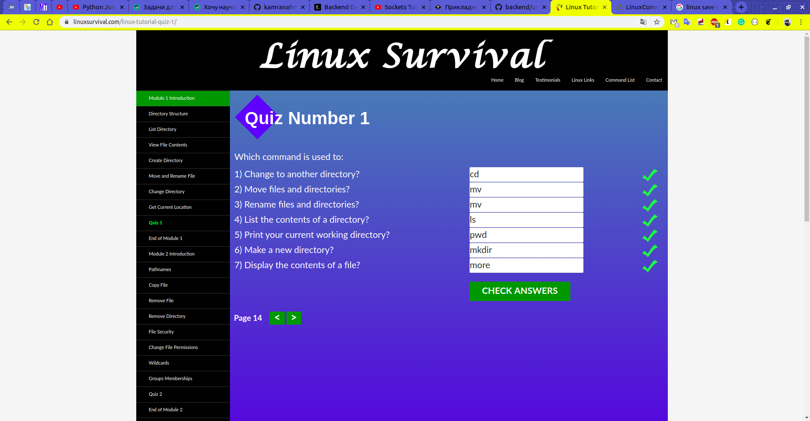
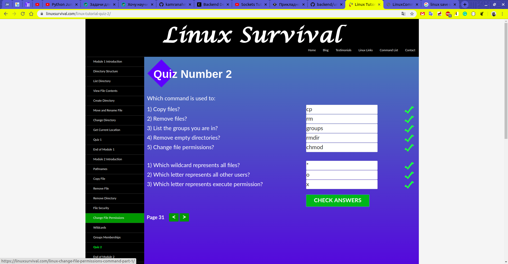
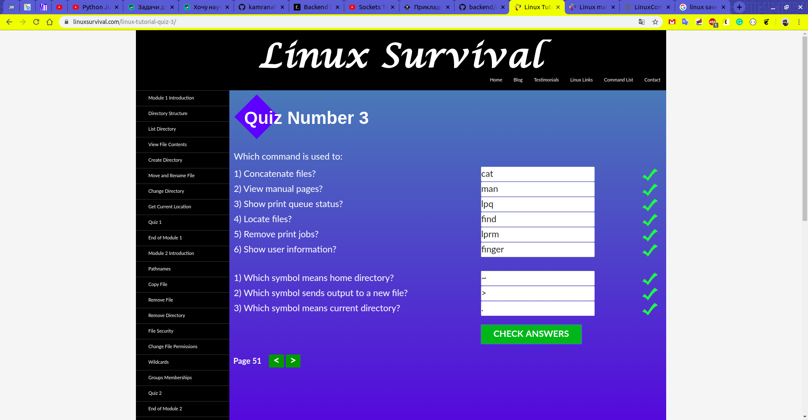
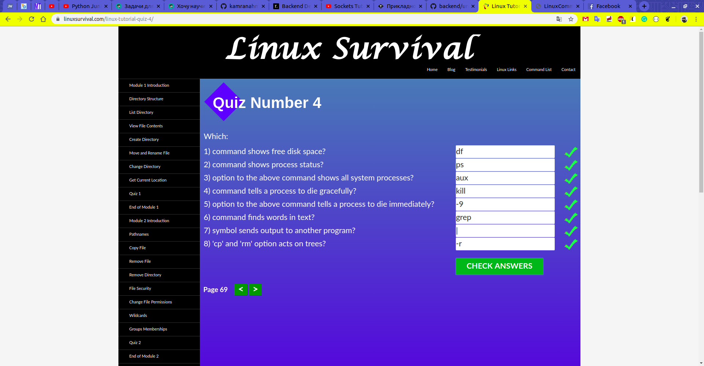
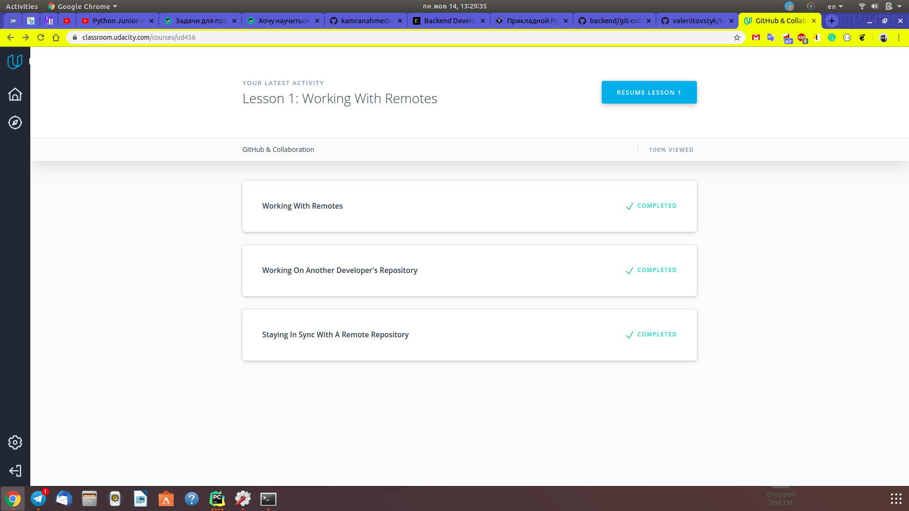

# kottans-backend
Kottans courses

## [Git basics](https://github.com/kottans/backend/blob/master/tasks/git-intro.md)
Very useful and interesting course. I've been working with git for a year but used only simple commands like commit, checkout, merge. This course broadened my view, moreover, I think about git in another way. And the biggest influence on it was made by [one of the references to self study resource from udacity course](https://learngitbranching.js.org/)

## [Unix shell](https://github.com/kottans/backend/blob/master/tasks/unix-shell.md)
### Results

### Impressions
(1) seems too old and not all information up to date. For example "more", when "less" is modern version. 
Also, there is no chance to think on correct answer if you mistook. However, it's free. So... thanks for it.  
(2) is very nice structured handbook. As I've already read "The Linux Command Line" by William Shotts, all that information
helped me to remember basics.

## [Git for Team Collaboration](https://github.com/kottans/backend/blob/master/tasks/git-collaboration.md)
### Results

### Impressions
This course was very interesting, but many info were duplicated from Git basics. Also, there was not enough practice. 
On the other hand, there were more complex things and was practice on GitHub. I've made PR and liked rebase before, so this course helped me to remember those pretty things.

## [Python Basics Part I](https://github.com/kottans/backend/blob/master/tasks/python_basics_1.md)
### Results
[My HackerRank profile](https://www.hackerrank.com/SpOleM98)
### Impressions
This course has useful links for new to Python people. Most of those articles I've already read before(maybe in some books). 
HackerRank tasks are interesting but I think the threshold is too low. Everyone spent at most 1 hour to achieve course aim(maybe even 30 mins).  